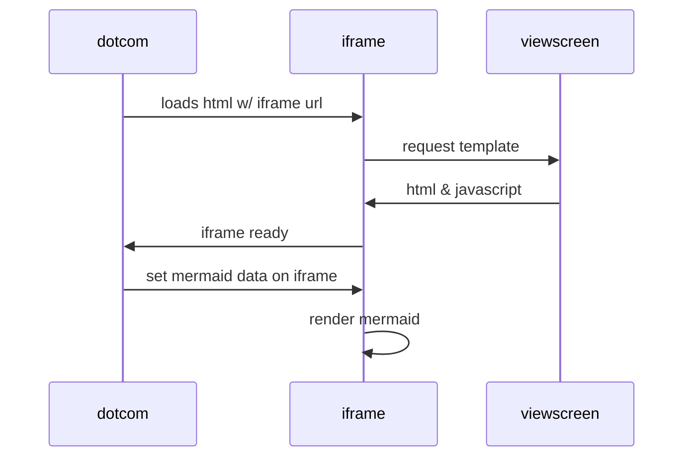

# Title 1

These are some words and such!

```python
print()
```

Cool!

> Blockquotes help you emulate reply text.
> This line is part of the same quote.

***


***



***

```python
def function():
    #indenting works just fine in the fenced code block
    s = "Python code"
    print s
```

Quote break.

> This very long line is still quoted properly when it wraps. Keep writing to make sure this line is long enough to actually wrap for everyone. You can also _add_ **Markdown** into a blockquote.

-   [x] Completed task
-   [ ] Incomplete task
    -   [ ] Sub-task 1
    -   [x] Sub-task 2
    -   [ ] Sub-task 3

1.  [x] Completed task
2.  [ ] Incomplete task
    1.  [ ] Sub-task 1
    2.  [x] Sub-task 2

* * *

   <p>
   <details>
   <summary>Click this to collapse/fold.</summary>

   These details <em>remain</em> <strong>hidden</strong> until expanded.

   <pre><code>PASTE LOGS HERE</code></pre>

   </details>
   </p>

* * *

<div class="alert alert-success" role="alert">
  This is a success alert—check it out!
</div>
<div class="alert alert-danger" role="alert">
  This is a danger alert—check it out!
</div>
<div class="alert alert-warning" role="alert">
  This is a warning alert—check it out!
</div>
<div class="alert alert-info" role="alert">
  This is a info alert—check it out!
</div>
<div class="alert alert-info" role="alert">
  This is a info alert with <a href="#" class="alert-link">an example link</a>.
</div>

* * *

<div class="alert alert-success" role="alert">
  <h4 class="alert-heading">Well done!</h4>
  <p>Aww yeah, you successfully read this important alert message. This example text is going to run a bit longer so that you can see how spacing within an alert works with this kind of content.</p>
  <hr>
  <p class="mb-0">Whenever you need to, be sure to use margin utilities to keep things nice and tidy.</p>
</div>

* * *

<a href="#" class="badge badge-success">Success</a>
<a href="#" class="badge badge-warning">Warning</a>
<a href="#" class="badge badge-info">Info</a>

* * *

<button type="button" class="btn btn-primary">Primary</button>
<button type="button" class="btn btn-success">Success</button>
<button type="button" class="btn btn-warning">Warning</button>

* * *

<ul class="nav nav-pills">
  <li class="nav-item">
    <a class="nav-link active" data-bs-toggle="pill" href="#home">Home</a>
  </li>
  <li class="nav-item">
    <a class="nav-link" data-bs-toggle="pill" href="#menu1">Menu 1</a>
  </li>
  <li class="nav-item">
    <a class="nav-link" data-bs-toggle="pill" href="#menu2">Menu 2</a>
  </li>
</ul>

<!-- Tab panes -->

<div class="tab-content">
  <div class="tab-pane container active" id="home">Hello</div>
  <div class="tab-pane container fade" id="menu1">Oooft</div>
  <div class="tab-pane container fade" id="menu2">Bye</div>
</div>
---
<ul class="nav nav-tabs" id="myTab" role="tablist">
  <li class="nav-item">
    <a class="nav-link active" id="home-tab" data-toggle="tab" href="#home" role="tab" aria-controls="home" aria-selected="true">Home</a>
  </li>
  <li class="nav-item">
    <a class="nav-link" id="profile-tab" data-toggle="tab" href="#profile" role="tab" aria-controls="profile" aria-selected="false">Profile</a>
  </li>
  <li class="nav-item">
    <a class="nav-link" id="contact-tab" data-toggle="tab" href="#contact" role="tab" aria-controls="contact" aria-selected="false">Contact</a>
  </li>
</ul>
<div class="tab-content" id="myTabContent">
  <div class="tab-pane fade show active" id="home" role="tabpanel" aria-labelledby="home-tab">...</div>
  <div class="tab-pane fade" id="profile" role="tabpanel" aria-labelledby="profile-tab">...</div>
  <div class="tab-pane fade" id="contact" role="tabpanel" aria-labelledby="contact-tab">...</div>
</div>

* * *
